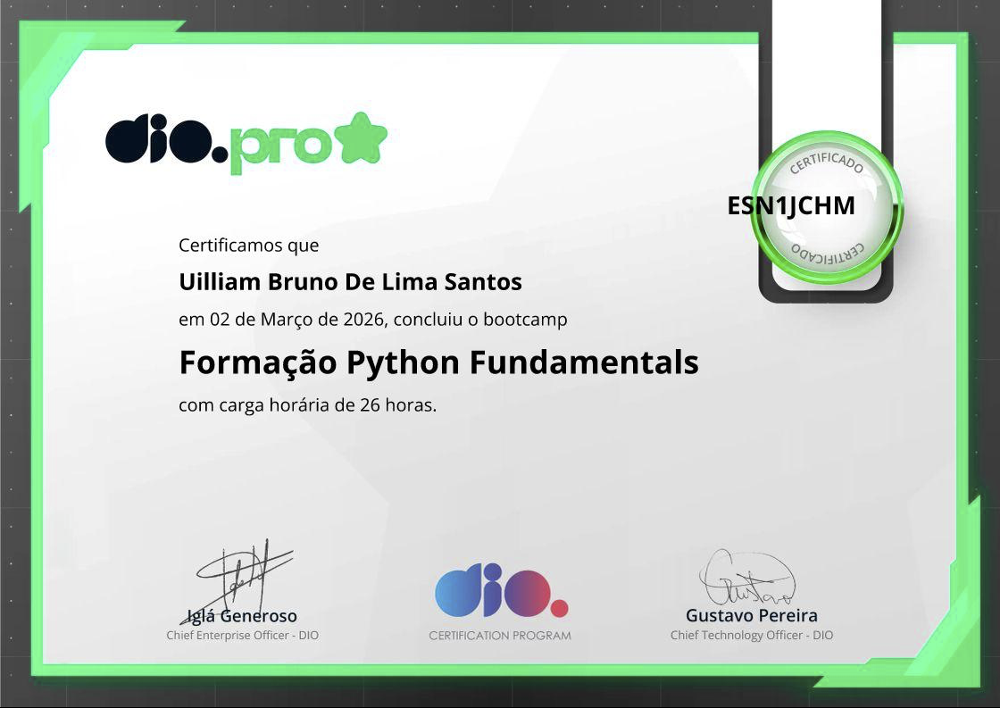
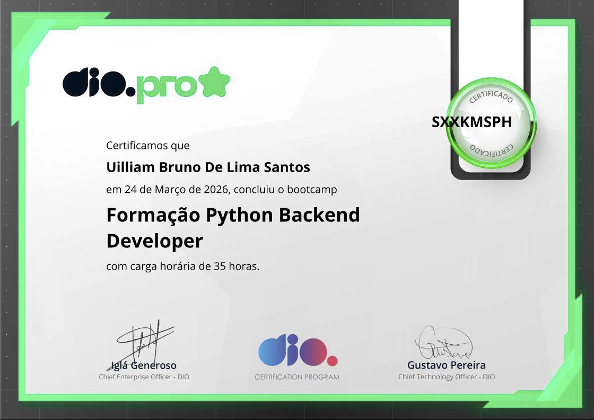

<h1 align="center">Hi 👋, I'm Uilliam Santos</h1>
<h3 align="center">Backend Developer with Python | APIs, Automation & Real Estate Tech</h3>

<p align="center">
🚀 Building scalable APIs, backend systems and automation tools <br>
🌍 Based in Dubai <br>
📚 Focused on Backend Engineering with Python
</p>

---

# 👨‍💻 About Me

I'm a developer with a background in **Frontend Development**, currently focused on **Backend Engineering with Python**.

I specialize in building **REST APIs, authentication systems, and data-driven applications**, with a strong focus on clean architecture and real-world problem solving.

I also combine **technology, finance, and real estate knowledge** to develop tools and systems that deliver practical value.

---

# 🧰 Tech Stack

## Backend


---

## Frontend


---

## Databases


---

## Tools


---

# 🚀 Projects

## 🏦 Bank API (FastAPI)

A banking system API built with FastAPI featuring:

- Account creation and management  
- Deposit and withdrawal operations  
- Balance validation  
- Transaction history (bank statement)  
- JWT Authentication  
- Clean architecture and async endpoints  

### Tech Used
```
FastAPI
SQLAlchemy
PostgreSQL / SQLite
JWT
Async Python

```

---

---

## 📝 Flask Blog API

A REST API built with Flask featuring:

- JWT Authentication  
- Users, Roles and Posts  
- Full CRUD operations  
- Database migrations  
- Automated tests  

### Tech Used
```
Flask
SQLAlchemy
JWT
Pytest
SQLite
```

---

## 🌐 Django Web Application

A full backend system built with Django:

- ORM-based data modeling  
- Admin panel  
- Structured backend architecture  
- Scalable project structure  

### Tech Used
```
Django
ORM
SQLite / PostgreSQL

```

## Real Estate Data Tools

Tools focused on **real estate analysis and automation**.

Features include:

- ROI calculations
- property comparison
- automation scripts
- market analysis

### Tech Used

```
Python
SQL
Automation
Data Analysis
```

---

# 📚 Currently Learning

```
Advanced Backend Architecture
System Design
Django
Microservices
AI Integration
```

---

# 🎓 Certifications

- Python Fundamentals Bootcamp (DIO) – 26h  
<p align="center">
    
</p> 
- Python Backend Developer Bootcamp (DIO) – 35h 
<p align="center"> 
    
</p>

---

# 📚 Currently Learning

```
Advanced Backend Architecture
System Design
Microservices
Scalable APIs
AI Integration
```

---

# 📊 GitHub Stats

<p align="center">

</p>

<p align="center">

</p>

---

# 🌍 Connect With Me

<p align="center">

<a href="www.linkedin.com/in/uilliam-santos-2206b8375">

</a>

<a href="mailto:uilliambruno@gmail.com">

</a>

<a href="https://github.com/uilliambruno-droid">

</a>

<a href="https://wa.me/9710585645920">

</a>

</p>

---

# ⚡ Fun Fact

I combine **technology, finance and real estate** to build smarter systems and tools.

---

⭐ If you like my projects, feel free to explore them and give them a star!
